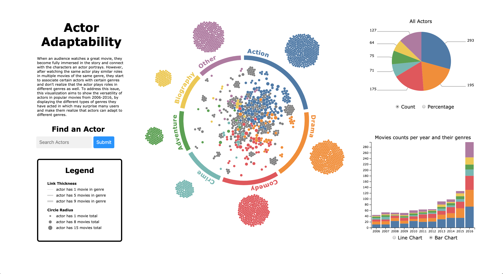
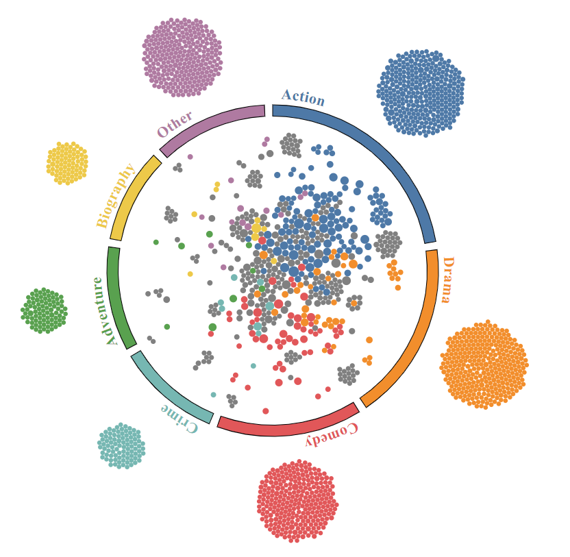

# project_436-visualizers - M3 Write-up

1. #### Overview

   - Actor Adaptability is a visualization made to show how actors have a diverse set of skills that allow them to act in multiple genres using data from the top one thousand movies of the last decade. The main view is a network diagram which shows all the actors of the dataset and the genres they tend to act in. Readers can use this to see how actors compare to each other in the number of movies and diversity of genres they have been in. They can also compare the genres themselves by how many and which actors have acted in them. There is also a pie chart showing how many movies there are of each genre. When an actor is selected, it shows the movie genre data only for movies that the chosen actor has been a part of. This view is useful for looking at the ratios of genres in more detail, and it is aided by counts or percentages, depending on the user’s selection. Below that is a view which can be switched between a line chart and a bar chart. It is for viewing how the genres have changed over time, and it can be used to show how both the popularity of a genre or an actor’s interest in a genre shifted between 2006 and 2016.

   

2. #### Data

   - Description of your data in both domain-specific and abstract language with cardinality
     - The dataset contains a list of one thousand movies (items) with their associated data in a tabular format. We used a subset of the attributes: genre (A set of four categorical elements where only the first, main one was chosen. It comes from a set of 7 elements.), actors (A set of four categorical elements. Each comes from a set of 1985 elements.), and year (A quantitative attribute from a range of integers in [2006, 2016].).
   - Data Source
     - https://www.kaggle.com/PromptCloudHQ/imdb-data
   - External Code Sources
     - https://stackoverflow.com/questions/14964035/how-to-export-javascript-array-info-to-csv-on-client-side
     - http://bl.ocks.org/mbostock/5100636
     - https://observablehq.com/@ericd9799/learning-stacked-bar-chart-in-d3-js
     - https://www.w3schools.com/howto/howto_js_autocomplete.asp
   - Data Pre-processing Pipeline
     - As linked above, we got our our original IMDB movies dataset from Kaggle.com. This dataset includes movies' genres, actors, and years produced, among other attributes. Our preprocessing pipeline consists of taking that information and transforming it into different JSON objects that are easier to manipulate and dramatically simplify the coding needed to produce the visualizations. Five JSON files are created as a result of our preprocessing pipeline:
       1. actor-links.json, which contains an array of all the pre-computed links that get displayed when an actor or genre is clicked in the network diagram,
       2. actor-to-genres.json, which contains an array of actors with counts of each genre they've played in,
       3. actor-to-year-genres.json, which contains a dictionary that maps actors to the number of movies of a certain genre the actor played in each year, and
       4. genre-to-actors.json, which contains an array of genres, each with a list of actors that have taken part in them, and
       5. actor-to-genre-count.json, which contains a dictionary that maps actors and genres to the number of movies of a certain genre the actor played in each year.

3. #### Goals and Tasks

   - Task Abstraction
     - Overall Task - Domain-specific
       - Our visualization aims to help the user realize the different genre of movies a specific actor has played over the past decade. Specifically, the network diagram allows users to browse through different actors and discover unique facts about a given actor, the pie chart will help the user discover the genre distribution of genres for a specific or group of actors, and the stacked bar chart will show the genre trends of each actor over the past decade. This visualization also allows the user to search for their favourite actor and develop better understanding of what types of movies the actor has been involved in over this time horizon.
     - Abstract Language
       - Analyze/Compare Trends
       - Discover Distribution
       - Browse Around
       - Search Nodes

4. #### Visualizations/Views and Rationale for Design Choices

   - **Network Diagram**
     - Marks:
       - *Point Mark* - Every actor in this dataset is represented with a node on the network diagram. Point marks are used because it's the most intuitive, there's no dimension that an actor should/would restrict since an actor is not defined with a specific value.
       - Channels:
         - *Spatial Positioning* - We used spatial positioning to display the actor's movie genre ratio where the actors that act in primarily action movies will have their representative nodes gravitated towards the "action segment" of the ring in the network diagram. If an actor has only worked in one genre, their node will be placed outside the ring into the affiliated genre. We believe this channel is effective and in combination with colour, really helps distinguish the different genres.
         - *Colour Hue* - We used colour hue to categorically disguish the different genres. Our rationale for this decision is due to the fact that colour is more effective that using symbols/shapes. We understand that colour hue does not scale well, but since we are only representing 7 different types of genres (including "other") we believe that this channel is appropriate. The colour of each node signifies the mode of an actor. That is, the genre they have done the most movies in. If the node is grey, it means that the actor has more than one mode. We used grey instead of combining hues as combining hues may complete mutate the colour to something completely different which may be unintuitive. In addition, if we were to combine the hues, this would create a lot more different colours which is difficult to distunguish.
         - *Area (2-D size)* - The actor's node size represents the number of movies they have acted in over the past decade. This distinction, however, is subtle and is merely present to provide the viewer with an overall idea rather than concrete numerical information. This is why we use our other views to display more detailed and quantifiable information about a specific actor.
         - *Line Width* - When an actor is selected/clicked on the network diagram, lines appear which connects to the genres which that specific actor has worked on. The width of the lines indicate the number of movies of that specific genre the actor has been a part of. Similar to node area size, this change is subtle and it is difficult for the user to fully derrive the quantitative information which again presents the need for our other views.
     - Interactions/Linkage
       - *Hover* - When a node is hovered, the actor's node becomes highlighted (outlined) and a detail tooltip appears which displays the name of the actor which the node represents. When a genre (ring segment) is hovered it and its name also get highlighted and all the actors that have acted in one or more movies in that given genre are also highlighted.
       - *Click* - When a node is selected/clicked, the data is filtered by reducing the opacity of all other nodes. Also, more details are shown by lines that connect that specified node to their affiliated genres appear. If a genre (ring segment) is clicked, all lines that connect actors to that specified genre will appear and the data will be filtered by reducing the opacity of the ndoes affiliated with actors not involved in this genre. The other views will update once an actor is selected to show additional and more detailed information about that specific person. If no node is selected, the other views (the pie and stacked charts) will  display the overall information of all the actors.
   - **Pie Chart:**

       - Marks:
         - *Line* - the angle of each slice represents the proportion of movies an actor has done in the genre associated with the slice. See angle channel description for more information.

       - Channels:
         - *Angle* - the total angle of a slice in the pie chart is proportional to the percentage of movies in that specified genre over the past decade. We are aware that this encoding may not be the most effective, but we really wanted to showcase a part to whole relationship which is why we used a pie chart. To further assist the user, we have added labels showing both the count and percentage to clarify the values.
         - *Colour Hue* - Used to represent the different genres. This colour encoding is the exactly the same as the network diagram to maintain consistency and avoid confusion. For more details, look at Network Diagram
       - Interaction/Linkage
         - *Hover* - When a slice is hovered, the slice's outline appears and its radius increases. Since length or area is not used as a channel in the pie chart, this does not skew what our data represents. When an actor's slice is hovered, the individual line that connects the actor's node to that hovered genre is displayed on the network diagram.
         - *Click* - When a slice is selected, all the other slices will have their opacity reduced (similar to the network diagram) and the line that shows up on over in the network diagram is fixated. The bar/line chart also update to further filter based on the genre selected in the pie chart.
         - *Radio Buttons* - The pie chart radio buttons allow the user to change how they view the data labels (either by count or percentage)
   -   **Multi-Line Chart / Stacked Bar Chart**
       - Marks:
         - Point Mark (Linechart) - the point represents the genre count of movies in a given year. The lines of the line chart connect the points to visualize an overall trend over time.
         - *Line Mark* (Barchart) - the length of a bar chart corresponds to a count of movies.

       - Channels:
         - *Hue* - Encodes the "genre" attribute. Colour encoding corresponds to both the network diagram and the pie chart. For more details, see the Network Diagram description.
         - *Horizontal position on a common scale* - encodes the "year" attribute (2006-2016).
         - *Length* - the length of a line mark in the bar chart  encodes a count of movies.
         - *Vertical Position on a common scale* - The vertical position of the points indicates the number of movies of a given genre in that year.
       - Interaction/Linkage
         - Currently, both the bar and line chart are unidirectionally linked to the chord diagram and pie chart, such that when an actor, genre, or pie slice is selected this view shows the correct distribution of movies produced that contain that actor and/or genre throughout the years from 2006-2016.
         - *Radio Buttons* - The line / bar chart radio buttons allow the user to toggle between seeing movie genre count data in line chart format or stacked bar chart format. We found that the line chart was better for visualizing trends when genres where selected or nothing was selected, but on the individual actor level, the stacked bar chart gave a clearer representation of the number of movies of each genre an actor had worked on over the years.

   **Screenshots**

   - Screenshot 1: Overall application with Bar Chart selected
   

   - Screenshot 2: Genre selected with Line Chart and Pie Chart Counts
   

   - Screenshot 3: Genre selected with Bar Chart and Pie Chart Percentages
   

   - Screenshot 4: Actor selected
   

   - Screenshot 5: Actor and genre selected through Pie Chart
   

   - Screenshot 6: Search autocomplete functionality
   

   - Screenshot 7: Actor selection through search functionality
   

5. #### Reflection

   - How the project has developed
      - Proposal
         - The project began as a way to explore the dataset we had found: the top 1000 movies from 2006 to 2016 on IMDB. We initially had planned on looking at the different genres (chord diagram) and revenues (bar chart) of the movies as well as the actors and who they tended to work with (matrix diagram). 
      - Changes Between Proposal to M2
         - We made some initial progress, however after talking to TAs and Professor Munzner, our initial chord diagram visualization proved to be ineffective and confusing in acheiving our task. We originally represented each actor with a set of chords (as each individual chord signified a switch in movie genres of a given actor) which is confusing and unintuitive. The chord diagram also does not scale well to our dataset. Even after bundling and setting each movie with a single main genre, it was still extremely difficult to read (Figure 1). We ended up creating something that looked visually appealing by hiding the chords behind a band but it was hacky and still did not resolve our confusing chord mark (Figure 2). Therefore, we have decided to pivot to represent each actor with a node in a network diagram (Figure 3). 
      - Figure 1
      - 
      - Figure 2
      - 
      - Figure 3
      - 
         - Upon further discussion, we realize that our other views were unique but did not link well with our main chord/network diagram view as there was little to no relationship between these visualizations. In addition, both these visualizations do not scale well and deciding which actors to completely filter out for the matrix diagram became a daunting task. These intended views also did not align with our new, more focused task objective of connecting each actor to genres. For these reasons, we decided to scrap these views and replace them.
         - We added a pie chart to show the genre distribution of each actor when a node is a selected. We believed that this linkage was more intuitive than the adjacency matrix while it also aligned better with our task. We also decided to replace the movie revenue pyramid chart from the proposal with a stacked bar chart depicting trends in genre popularity over time. The x-axis measures the years from 2006-2016 and the y-axis measures the number of movies produced in a given year. Hue encodes how many movies were produced in a given genre, and the counts for movies of different genres within the same year are stacked one on top of the other. The view connects to the chord diagram, such that when an actor is selected, only the counts for movies that the actor has played in are displayed, and when a genre is selected, only the counts for movies within the selected genre are displayed. It also supports the selection of a genre and an actor, such that only movies played by the selected actor within the selected genre are displayed.
      - Changes Between M2 and M3
         - The network diagram and the pie chart ideas stayed similar during these weeks, and it was only our third visualization, the bar chart, that changed. We decided to add the ability to switch between a line chart and a bar chart where both showed the same data. We did this because we found that it was hard to compare the trends of the different genres since they were not aligned. We chose a line chart for this because they are aligned and have lines between points. The slopes of these lines can help the reader see the difference in trends between genres more easily. We kept the bar chart as a toggle option since it was useful for viewing the total number of movies and was less difficult to understand when one actor was selected. Finally, we also added a title, short description, legend, and search bar where the user can type the name of an actor and see them selected in the diagrams.
   - How our visualization goals have changed
      - The visualization goals have not changed between M2 and M3, but they did change between the proposal and M2. Initially, our goal was vague. We were trying to exploit our dataset as much as we could without thinking about whether or not it made sense. After some thought and discussion with the instructors, we realized we needed a more focused goal, so we narrowed down to genres and actors. From then on, we only created visualizations that supported the goal of showing how actors can adapt between different genres.
   - How our technical goals have changed
      - Our initial goal was to have a chord diagram that couldn "explode." This means the user could select a chord and see it split into many lines, one for each actor who was a part of the original chord. This was challenging because it was not clear what an item was. One actor (our item) was represented by a series of lines (one for each pair of genres an actor was in), but when a chord was exploded the user only saw one of these lines per actor. This, along with other difficulties, made us reconsider and change to a network diagram. This new idea was still interesting and new, but used components that we were more confident with, such as force diagrams.
   - How realistic the original proposal was
      - The original goal of the chord diagram may have been possible, but not without significantly more work than we ended up putting in. It also would likely not have been as smooth and would have used some hacks to get working. For example, transitioning between a chord and an exploded set of lines would not have been easy and may have required two visualizations on top of each other being faded in and out. The rest of the original proposal was realistic but parts were not used for the reasons stated above.
   - Things we couldn't figure out or didn't have time to do
      - If we had more time, we would have liked to remove the small lines that cut into the slices of the pie chart when one slice is selected and another is being hovered over. Also, we would have liked to make a transition between the bar chart and the line chart. These would have just added to the polish of the project.
   - What would we do differently next time
      - If we had access to instructors, we would ask them for advice and feedback earlier in the process. This time, we spent many hours on visualizations that were completely removed in the end. These hours could have been saved if we had asked for earlier feedback. We would also make sure that our goal/task is very clear and that all of our visualizations directly supported it.
   
6. #### Team Assessment

   - *Harlan*
     - Harlan created the network diagram (which includes the click functionality and tooltip) and handled all the data-preprocessing for this project. Harlan also created the legend and the short description associated with our project.
   - Ethan
     - Ethan created the pie chart (which includes the click functionality and the bidirectional linkage) and also implemented the search bar for the project. Ethan also took the lead in regards to the project milestone writeups.
   - Ian
     - Ian created both the line and bar chart for this project. He was also responsible for linking his charts up to the other views. Ian also did a bit of data-preprocessing for his views and contributed to all our writeups.
